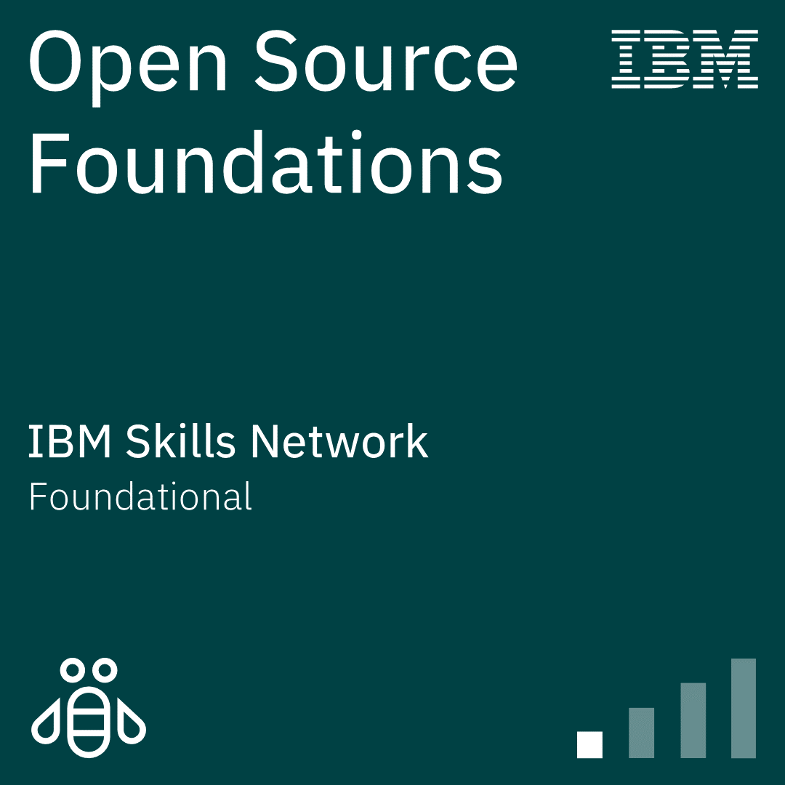
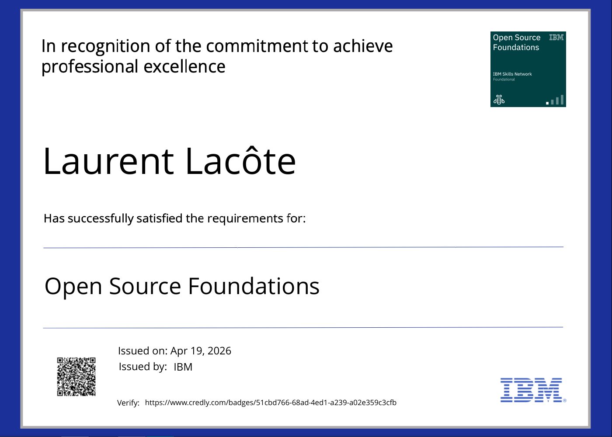
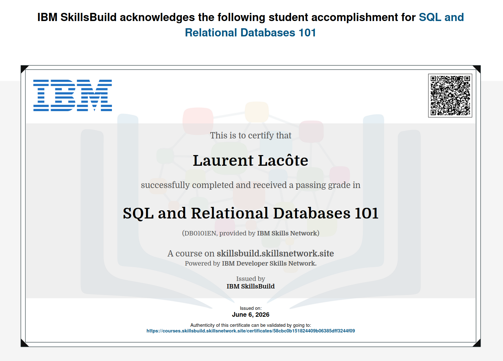
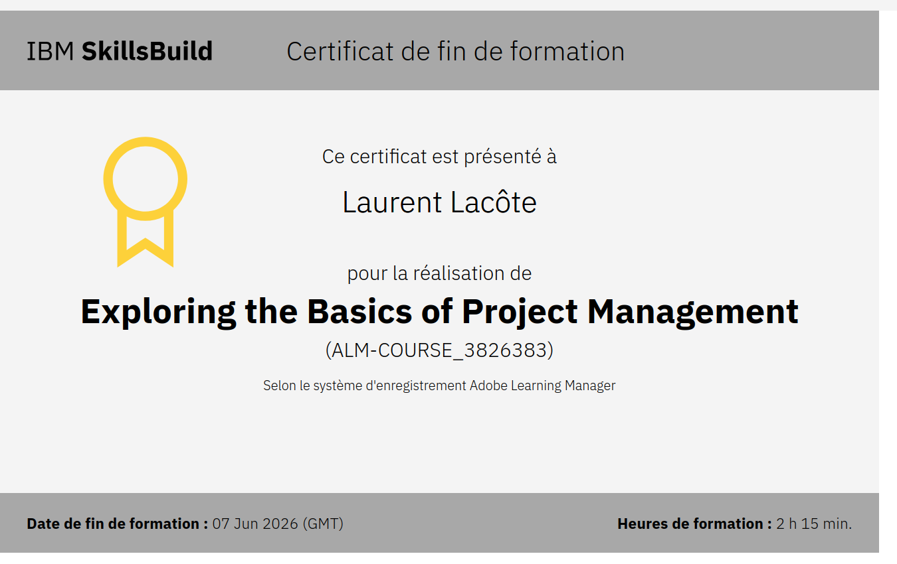
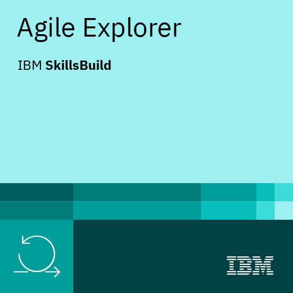
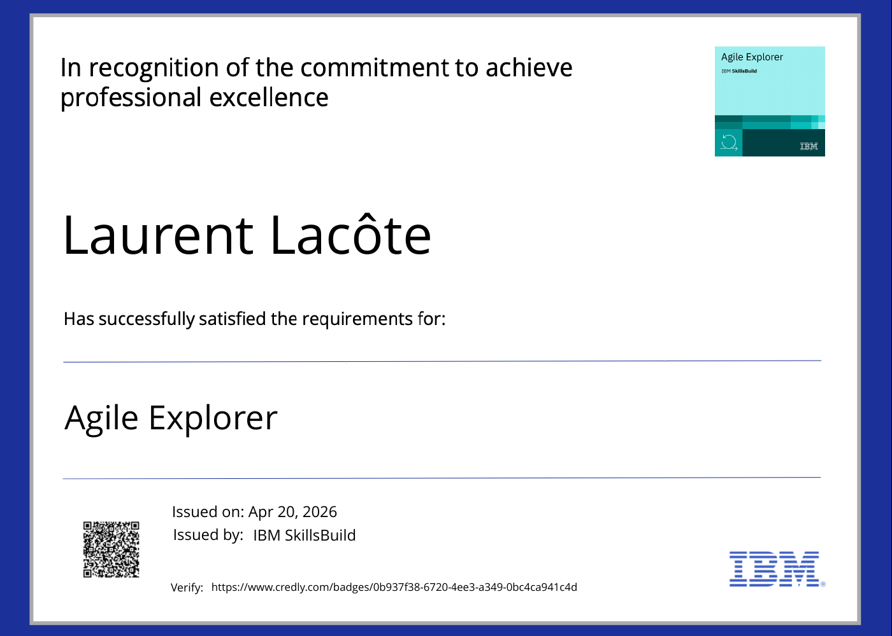

# Laurent Lacôte - IT knowledge and know-hows related certifications

This repository will hold certifications obtained through self-teaching online websites such as IBM Skill Suite and others.

## Holberton School enticed trainings

### Open Source Foundations - Principles, benefits & stakes, approaches to set one up
All the essential concepts to understand...
- The core essence of what an open source project is.
- What key differences exist between different open source licenses and key criterias to know how to choose the one most adequate for a project.
- How to structure an open source project's governance and collaboration processes to maximize the chance of creating a positive, self-sustaining growth dynamic.

  
  

View [Open Source Foundations certification online](https://www.credly.com/badges/51cbd766-68ad-4ed1-a239-a02e359c3cfb).

### SQL & Relational Databases 101 - Everything required to set up simple projects with SQL-based engine.

This course aims at giving all the (primary and foreign ;)) keys to bootstrap oneself in the use of relational databases. Everything required to cover simple, practical use-cases in real life projects is covered.
- Main concepts and associated vocabulary (schemas vs instances, what is a "relation" in SQL vocabulary, acronyms for Data Manipulation / Definition / Control).
- SQL instructions required to manage the full lifecycle of a database (CREATE / ALTER / DROP tables, INSERT / UPDATE / DELETE rows).
- SQL clauses used to manage more complex / precise instructions sequences to retrieve or update data (types of JOIN, filtering with WHERE / GROUP BY + HAVING, sorting with ORDER BY).

  

View [SQL & Relational Databases 101 certification online](https://courses.skillsbuild.skillsnetwork.site/certificates/58cbc0b151824409b06385dff3244f09#).

### Project Management Fundamentals - Covering the missions, stakes and tools of a Project Manager

This course brushes up a detailed view of everything pertaining project management, from the various terms used to qualify each aspect up to the main organizational frameworks.

- Understanding the various aspects of project management: analyzing goals/requirements/stakes, identifying stakeholders, risks and "enablers", decomposing all the work into achievable milestones, setting up collaboration processes and tools to keep up motivation and teamwork...
- Projecting into the potential conflicts arising from different interests between stakeholders or unanticipated risks and how to tackle them.
- Assimilating the core concepts and phases of the three most known organizational frameworks: Waterfall, Agile and Hybrid.

  

View [Project Management Fundamentals certification online](https://skills.yourlearning.ibm.com/certificate/ALM-COURSE_3826383).

### Agile Explorer - Agile Approach & how to put it in practice
A broad yet deepened overview of all the vocabulariy and broad strokes making up the essence of Agile Approach and how to apply it in projects of any size and context.
- Agile Approach: core values and concepts
- Collaboration tools and processes brewing trust and continuous efficiency improvements.
- Operations workflow: optimizing repeatable and predictible tasks.
- Program workflow: using a "decomposed, user-feedback oriented workflow" to progress while keeping the end-user satisfaction as prime goal as it offers the best perspective of success from a business/project management perspective.

  
  

View [Agile Explorer certification online](https://www.credly.com/badges/0b937f38-6720-4ee3-a349-0bc4ca941c4d).
